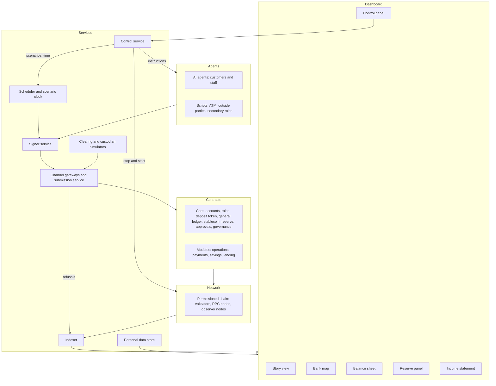
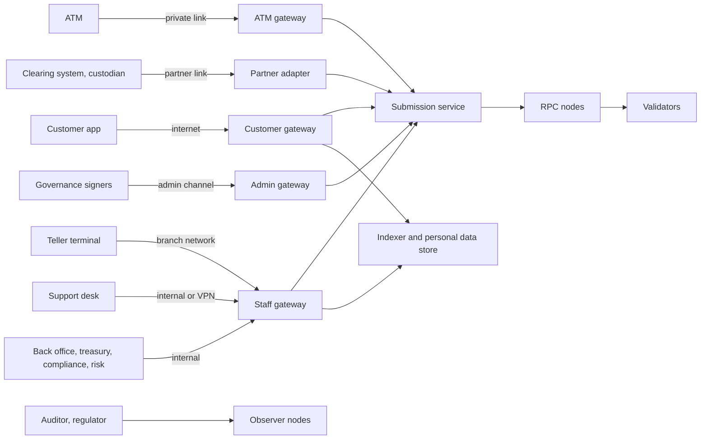
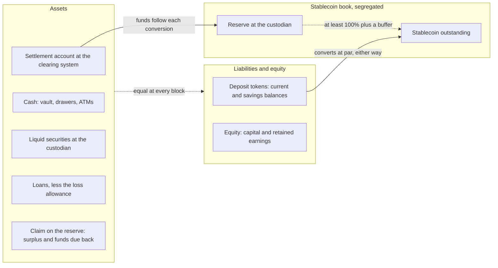
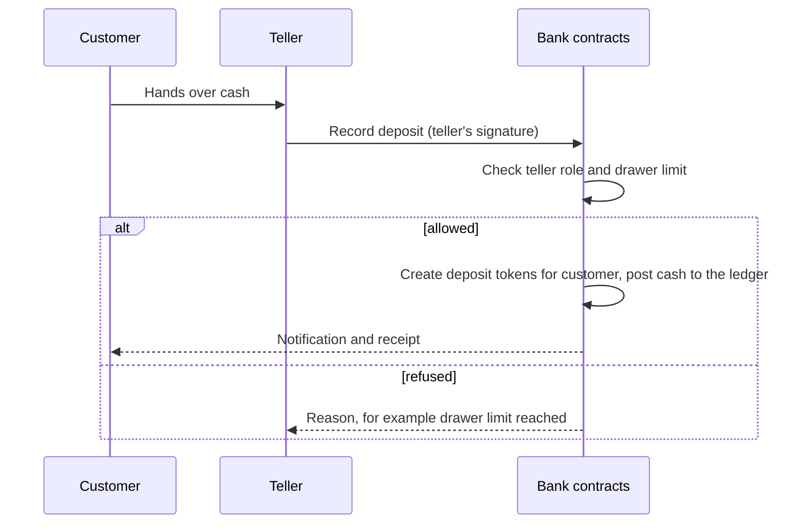
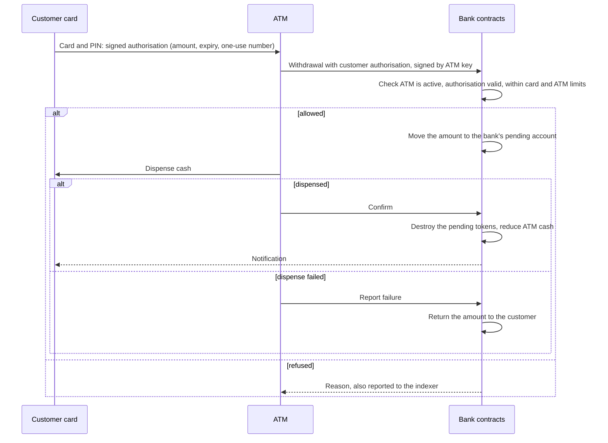
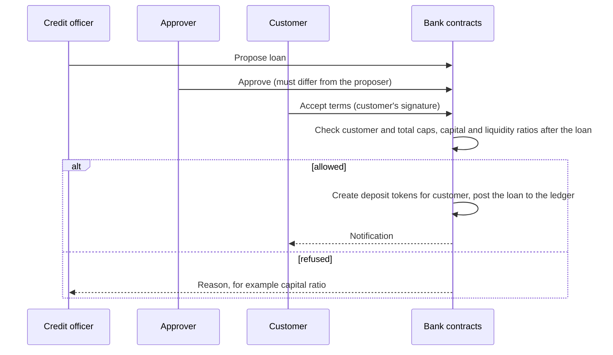

# Architecture

## Positioning

The bank's everyday money is a tokenised deposit. Each current-account balance is a token that is a claim on the bank, as a bank balance is today. Lending creates these tokens and repayment destroys them, within capital and liquidity limits the chain enforces. Savings accounts and loans are modules on top. Beside it the bank issues a fully reserved HKD-referenced stablecoin as a separate product.

Three things keep it a recognisable bank:

- **Assisted service.** Customers can act for themselves from their own devices, but tellers and ATMs still take cash, act on customers' instructions, and handle anything large, unusual or needing identity checks.
- **Open to the payment system, closed as a ledger.** Customers pay and are paid by account holders at other banks through a simulated clearing system. Only holding the tokens is closed: the chain is private and every holder is an onboarded customer. Taking the stablecoin onto a shared chain is a planned [expansion](plan.md#cross-chain), not part of this design.
- **Two forms of money, each for what it suits.** The deposit token is for everyday banking: a claim on the bank that funds lending and earns interest in a savings account, the form Hong Kong banks are piloting in Project Ensemble. Its backing is the bank's balance sheet, which is kept on chain as a general ledger. The stablecoin is for holders who want a claim backed by a segregated reserve and not by the bank's balance sheet, and it is the token that could later leave the perimeter.

## Layers



| Layer | Responsibility |
|---|---|
| **Network** | A permissioned EVM chain (Hyperledger Besu) with validators at independent sites, RPC nodes for applications, and read-only nodes for the auditor and regulator. A single-process chain is used for development and tests. See [network](#network). |
| **Contracts** | The rules. Nothing above this layer is trusted to enforce anything. |
| **Services** | Hold keys, carry requests to the chain, turn chain events into a timeline, drive time, simulate outside parties, and keep personal data off the chain. |
| **Agents** | Decide what to attempt. They never hold keys and cannot bypass the contracts. |
| **Dashboard** | Explains what happened and why, for a non-technical viewer, and lets the operator direct agents and trigger scenarios. |

## Network

The local network runs the same node software, consensus and configuration as a real deployment, one container per node.

| Node type | Count | Purpose |
|---|---|---|
| **Validator** | 4 | Produce blocks. Named by site: two primary data centres, a disaster recovery site, a cloud region. |
| **RPC node** | 2 | Serve applications behind a load balancer. Validators are never exposed to clients. |
| **Observer** | 2 | Read-only full nodes for the auditor and the regulator. |

All of these are full nodes holding the whole ledger; only validators take part in consensus. Besu has no light-client mode that we know of, so a site that should not hold the ledger is a plain client of another node.

- **Why four validators.** The consensus (QBFT) needs more than two thirds of validators online. Four tolerate one failure; seven would tolerate two.
- **What the validators do and do not prove.** All four belong to the bank, so agreement among them protects against a site failing, not against the bank itself. The independent check comes from the observers. The auditor's and the regulator's nodes re-execute every block, and each signs a checkpoint of the latest block at end of day with a key the bank does not hold. A rewritten history would not match those checkpoints. Independent validators arrive only with a shared chain, which is an [expansion](plan.md#cross-chain).
- **Branches hold no ledger.** A branch is a client of the central RPC nodes, as a branch today is a client of the core banking system. Retail premises are the weakest sites for power, network and physical security, and a full node holds every customer's balances.
- **Ledger privacy.** Every full node holds balances and transfers by address, with no names. Node disks are encrypted, node interfaces are reachable only by gateways and the indexer, and the link from address to person lives in the personal data store. The auditor and regulator see every movement as it happens, without names, and obtain identities through the personal data store under their role. That is more than a regulator sees today; it is a choice of this design, not current practice.
- **No offline writes.** Nothing confirms without a quorum of validators, and a branch or ATM cut off from the RPC nodes stops. Real ATM networks allow limited offline approvals; this design does not.
- **Two profiles.** A single-process chain for everyday development, and the full network for demonstrations.

What differs from production: all nodes share one machine, keys are held by the signer service and not a hardware module, and network zones are Docker networks, not real firewalls.

### Failure scenarios

| Scenario | Behaviour |
|---|---|
| One validator stopped | The chain continues on three; blocks may pause briefly when the missing node's turn comes up |
| Two validators stopped | The chain halts. Nothing confirms, but nothing is lost or forked. Transactions queue. |
| Validators restarted | They catch up, the chain resumes and queued transactions go through |
| One RPC node stopped | The load balancer routes to the other |
| Network split | The side with fewer than three validators stops |
| Validator permanently lost | The remaining validators vote it out and a replacement in |
| A channel gateway stopped | That channel stops; other channels continue |
| Branch link cut | That branch stops; its customers use the app, an ATM or another branch |

Halting when quorum is lost is deliberate: the consensus prefers stopping to risking two versions of the ledger.

## Channels

No client talks to a validator. Every party reaches the chain through a gateway for its channel, which forwards to the RPC nodes.



| Channel | Who | Network | Where the signature is made | Notes |
|---|---|---|---|---|
| **Customer app** | Customers | Internet | On the customer's device, by passkey | The app sends a signed authorisation; the key never leaves the device |
| **ATM** | ATMs | Private link to the bank | In the machine's hardware module, plus the customer's card and PIN | See [customer authorisation](#customer-authorisation) |
| **Branch** | Tellers, supervisors, branch manager, account opening, vault custodian | Branch network | On the staff member's device or hardware token | The customer authorises by card, by device, or on paper |
| **Support** | Support desk | Internal network or VPN | Staff device | Protective and servicing functions only; no paying out to others. See [customer authorisation](#customer-authorisation). Customer details come from the personal data store, gated by role. |
| **Head office** | Back office, compliance, treasury, finance, risk, IT security | Internal network | Staff device | |
| **Partner** | Clearing system, custodian | Dedicated partner link | Partner signs its own messages | An adapter relays ISO 20022 payment messages and signed statements to the chain. The contracts check the partner's signature against its registered key, so the adapter holds no role that can create money. Partners hold no chain accounts. |
| **Admin** | Governance signers | Separate admin channel | Hardware keys | Used only for multi-signature approvals |
| **Assurance** | Auditor, regulator | Their own observer nodes | Checkpoints only, kept off chain | Read-only on the ledger |

**What each part does**

- **Gateway.** One per channel. Establishes a session, limits request rates, logs, and exposes only the functions that channel needs. It never holds signing keys.
- **Submission service.** Simulates each signed request before sending it, sends it to the chain, and reports the outcome, including refusals, to the indexer. Gas is free, so it pays nothing on anyone's behalf.
- **Reads.** Applications read through the indexer and personal data store, which apply the caller's role. They do not query nodes.

**Trust**

- A gateway is not trusted to authorise anything. The chain checks every signature and role itself, so a compromised gateway cannot move money. It can only delay or drop requests. That holds for the partner adapter too: a payment in or a statement is accepted only with the partner's own signature.
- A partner is trusted for what it signs. A stolen partner key could create money against a credit that never arrived, so partner keys are significant keys, registered and replaced only through governance, and finance reconciles against the partner's own records.
- A channel failing affects that channel only. If the ATM gateway is down, branches and the app continue.
- Zones (internet-facing, branch and ATM, internal, partner, chain) are separate networks, so a client in one zone cannot reach the nodes or another zone's gateway.

**In the simulation**

- The signer service stands in for every device's secure hardware: phones, cards, staff tokens and ATM modules. When the operator takes over a role, a real passkey in the browser signs instead.
- The gateways run as one service with a route set per channel, on separate Docker networks per zone.

## Design rules

1. **The chain decides, agents propose.** An agent's prompt is never the control. If an agent attempts something outside its role, the contract refuses it.
2. **Authority comes from role and device, not from a key.** People and devices come and go; accounts and balances do not move.
3. **No personal data on chain.** The chain holds addresses, identifiers and hashes. Names, ID details, payment details and scanned instructions live in an ordinary database, so they can be corrected or deleted.
4. **Reads are gated like writes.** Staff and agents read through services that apply the same roles, not by querying nodes directly.
5. **Each money keeps its own rule.** Deposit tokens are created or destroyed only with a balanced ledger entry, and by lending only within the capital and liquidity ratios. The stablecoin is always fully backed.
6. **Products are modules.** Each product is built on the tokens through standard interfaces and can be added or removed without changing the core.
7. **Use audited standard components where they fit.** Write only the bank-specific logic. See [standards](standards.md).

## Account model

Every party is a smart account with a stable address.

| Party | Account type | Signers |
|---|---|---|
| Retail customer | Multi-signer account | Each of the customer's devices and their bank card, any one sufficient |
| Corporate customer | Multi-signer account with a threshold | Authorised signatories, for example any two of three |
| Staff member | Multi-signer account | The staff member's devices; holds roles in the access manager |
| Machine (ATM) | Single-key account | A key held in the signer service, standing in for a hardware module |
| Bank-owned accounts | Role account | Whoever currently holds the controlling role |

Bank-owned accounts are the few that hold tokens in passing: pending withdrawals and payments, suspense, and stablecoin awaiting burn. The bank's own funds are not a token balance. A deposit token is a claim on the bank, so the bank holding one would owe itself; its funds are equity in the [general ledger](#money-model).

Adding or removing a device changes the account's signer list. Hiring or offboarding a staff member grants or revokes roles. In both cases the account address, its balance and its history are untouched.

Staff always transact from their own account, never through a shared one. This keeps every action attributable to a person and lets the contracts check that the approver of an operation is not its maker.

### Device trust tiers

| Tier | Example | Trust basis |
|---|---|---|
| Customer device | Phone or browser passkey | Possession plus biometric or device PIN |
| Bank card | Chip card with PIN | Possession plus PIN, used at a bank-controlled terminal |
| Staff terminal | Teller workstation | Bank-managed device plus staff role |
| Machine | ATM | Bank-managed hardware key |

A multi-signer account treats its signers as equal, so limits do not depend on which device signed. They are set by channel. The contracts see who submitted the request (the account itself from the app, an ATM, or a teller) and apply a rate limit keyed by account and channel. A card signs only at a bank-controlled terminal, so the ATM and branch channels cover it.

### Customer authorisation

How a customer consents depends on the channel. Self-service is limited by amount; the branch is not, and adds people as the amount grows.

| Mode | Where | Evidence the chain sees | Controls |
|---|---|---|---|
| **Own device** | App, or at a counter | Customer's signature | App limit when sent from the app |
| **Card and PIN** | ATM, counter | Card's signature, submitted by the ATM or teller | ATM limit when used at an ATM |
| **Paper instruction** | Counter | None from the customer. The teller attests to an in-person identity check, attaching the hash of the scanned slip. | No amount cap; approvals escalate with amount; customer notified at once |

The branch is the highest-trust channel. Identity is checked in person and more than one member of staff is involved, so a customer at a counter can do anything, including what their own devices cannot.

- **No cap, escalating approval.** A teller alone handles small amounts. Above a threshold a supervisor approves, above a higher one the branch manager as well, and compliance for the largest. A larger amount never means a refusal, only more people.
- **More than self-service.** The branch can recover an account with no devices left, raise the customer's own limits, register a payee on the spot, unfreeze and close.
- **On by default.** Assisted service needs no opt-in. A customer may restrict it for their own account.
- **Collectively, not individually.** No single member of staff is all-powerful; the branch as a whole is.
- **Still inside the bank's rules.** The lending guard, the mint guard, a pause, compliance holds and screening apply to the branch as to everyone.

Paper is how most branch customers instruct a bank today, so it is a normal path. It is also the main path where the bank moves a customer's money without the customer's own cryptographic consent:

- **Who can act.** Only the assisted-operations module, called by a teller of the customer's branch, with the approvals the amount requires. Every debit on paper needs at least one approver besides the teller.
- **What it leaves behind.** The teller, the approvers and the slip hash are recorded with the operation. Internal audit samples operations against the scanned slips.
- **What it does not stop.** Staff acting together can move a customer's money. That is true of any bank; the defences are the number of people required as amounts grow, the notification, the audit trail and the customer's ability to dispute.
- **Disputes.** A disputed operation can be frozen by support and reversed by back office with compliance approval.

**Support** is all-powerful to protect and to help, not to pay out. Identity over the phone is weaker than at a counter, and call centres are the main target for impersonation.

- **Can, at any amount and at once:** freeze, revoke devices and cards, stop a pending payment, open a dispute, lower limits, move money between the customer's own accounts and products.
- **Cannot:** send money to a new destination, raise limits, or register a payee. Those need the customer's own device or a branch visit.

Credits to an account, such as a cash deposit or an incoming payment, need no customer authorisation.

### Bank-initiated movement

A bank can move a customer's money without the customer signing, and a simulation of one must be able to as well. Both tokens carry a forced transfer that no person can call directly. Only these modules can, each with its own approvals, and each use records who acted and why:

| Path | Called by | Approvals | Evidence recorded |
|---|---|---|---|
| Paper instruction | Teller of the customer's branch | Branch approval ladder | Slip hash |
| Move between a customer's own accounts and products | Support | None; source and destination must be the same customer | Call reference |
| Reverse a disputed operation | Back office | Compliance | Dispute reference |

A forced transfer cuts through a freeze, by design of the standard. Dispute reversal relies on that: it takes money that is frozen. The other two paths must not, so those modules refuse anything beyond the customer's unfrozen balance. In every case the recipient must be an onboarded account.

A freeze and an operational hold are different things. A freeze is placed by compliance, support or a dispute and stays in the customer's account; each is a named hold, and the frozen amount is their sum. An ATM withdrawal or a payment awaiting release instead moves the amount to a bank-owned pending account, under the customer's own authorisation.

Freezes and forced transfers reach savings shares as well as the two tokens, so money cannot be put beyond a hold by moving it into the savings account.

Fees, loan instalments and standing orders are not forced. They are collected under a mandate the customer signed.

A reversal takes back only what is still in the recipient's account, which is why a dispute freezes first. If the money has gone and the bank was at fault, the bank makes the customer whole from its own funds, as an expense.

### Account recovery

A customer who has lost every device and their card still owns the account. The account lets one bank module change its signer list: the recovery module, called by an account opening officer with a supervisor's approval, after an in-person identity check. It can add and remove signers and nothing else; it cannot move money. The customer is notified through every contact the bank holds.

### Customer account controls

- Customers can set their own lower limits per type of transaction.
- The number of devices and cards bound to an account is capped.
- Every account operation sends the customer a notification through the bank's own channel.
- Customers can see their full transaction history.

## Money model

The bank's books are a double-entry general ledger kept on chain. Every operation that creates, destroys or reclassifies money posts a balanced entry in the same transaction as the token movement, so the tokens and the books cannot disagree.



### Chart of accounts

| Account | Side | What it holds |
|---|---|---|
| Settlement account | Asset | The bank's balance at the clearing system, attested |
| Cash | Asset | Vault, drawers and ATMs, attested by count |
| Liquid securities | Asset | The bank's own bills at the custodian, attested |
| Loans | Asset | Principal outstanding |
| Loan loss allowance | Asset, negative | Expected losses on loans not yet written off |
| Reserve surplus | Asset | The bank's own money in the stablecoin reserve: the buffer and retained yield. It ranks behind the holders. |
| Due from reserve | Asset | Reserve released by redemptions and not yet back in the settlement account |
| Deposits | Liability | All deposit tokens outstanding |
| Equity | Equity | Capital and retained earnings |

The stablecoin outstanding and the reserve that backs it stay in their own book. The general ledger carries only what is the bank's own: the surplus and funds due back.

### The deposit token

One token is one Hong Kong dollar the bank owes its holder: a current-account balance.

| Event | Deposit tokens | Other side of the entry |
|---|---|---|
| Cash paid in | Created | Cash rises |
| Payment received from another bank | Created | Settlement account rises |
| Loan drawn down | Created | Loans rise |
| Interest paid to savers, a refund | Created | Retained earnings fall |
| Stablecoin redeemed | Created | Due from reserve rises |
| Cash paid out | Destroyed | Cash falls |
| Payment sent to another bank | Destroyed | Settlement account falls |
| Loan repaid | Destroyed | Loans fall by the principal part; the interest part raises retained earnings |
| Fee charged | Destroyed | Retained earnings rise |
| Converted to stablecoin | Destroyed | Funds moved to the reserve |
| Transfer between customers | Moved | None; the bank owes the same total |

Some entries move no tokens:

| Event | Entry |
|---|---|
| Loss allowance raised or released | The allowance and retained earnings move together |
| Loan written off | Loans and the allowance fall; any shortfall falls on retained earnings |
| Buffer topped up | Settlement account falls, reserve surplus rises |
| Reserve yield, or bills revalued | Reserve surplus and retained earnings move together |
| Redemption funds arrive from the custodian | Due from reserve falls, settlement account rises |
| Excess reserve withdrawn | Reserve surplus falls, settlement account rises |

- **Lending guard.** A loan creates money backed by a loan, not by funds received. The ledger refuses a drawdown unless both ratios still hold after it:
  - **Capital ratio.** Equity over loans net of the loss allowance, at or above a minimum.
  - **Liquidity ratio.** Settlement balance, cash and liquid securities over deposit tokens, at or above a minimum. The reserve surplus and funds due from the reserve are not counted; they are not the bank's to spend until they reach the settlement account.

  Governance sets both on risk's advice. They are simplified stand-ins for the capital adequacy and liquidity rules a real bank reports under.
- **Paying out needs liquidity.** A payment to another bank draws on the settlement account and a cash withdrawal on cash. If the settlement account cannot cover a payment, the payment queues until treasury funds the account by selling liquid securities. A bank can be solvent and still run short; the run scenario shows it.
- **Attested assets.** The chain cannot see assets held outside it. The settlement balance comes from the clearing system's signed statements, securities from the custodian's, and cash from counts under dual control. The ledger checks each statement's signature against the partner's registered key. Finance reconciles each against the ledger; a mismatch is an incident, and lending stops while a figure is stale. The chain enforces that the books balance and that the ratios hold on attested figures. It cannot enforce that the assets exist.
- **Income and losses are booked as they arise.** Loan interest is booked as income when an instalment is collected. The loss allowance moves when a loan's status changes: performing, in arrears or defaulted, at rates governance sets on risk's advice. A loan goes into arrears when a scheduled collection fails, and defaults after a set number of missed instalments. Equity therefore already reflects expected losses when the lending guard reads it. This is a simplified stand-in for the accrual and expected credit loss rules a real bank reports under.
- **Losses fall on equity.** The allowance charges expected losses to retained earnings as a loan's status worsens. A write-off removes the loan against its allowance, and any shortfall falls on retained earnings. Depositors are owed by the bank and are not exposed to individual borrowers. When equity falls to the minimum ratio, lending stops. Below zero the bank is insolvent and the dashboard says so; resolution and any deposit protection payout are legal processes and not modelled.
- **A deposit, in law.** The deposit token is a bank deposit, the kind a deposit protection scheme covers up to a limit per depositor. The stablecoin is not a deposit. The dashboard labels each balance accordingly.

### The stablecoin

A separate, optional product. A customer converts part of their deposit balance into it, and back, at par.

- **Issuance.** Only by converting the customer's own deposit balance. The deposit tokens are destroyed, the bank sends the same amount from its settlement account to the reserve at the custodian, and stablecoin is issued to the customer.
- **Redemption.** The stablecoin is burned and deposit tokens are created in the same transaction, at par and at once. The ledger records the same amount as due from the reserve, and the custodian returns it to the settlement account under a standing instruction, with no approval needed and never more than was burned. Until it arrives it does not count as liquid. Cash or a payment out from there is ordinary banking.
- **Mint guard.** The token refuses any issuance that would take supply above the reserve the custodian last confirmed in a signed statement, and refuses all issuance when that confirmation is stale. The guard enforces consistency with the custodian's figure; the custodian is trusted for the figure itself.
- **Buffer.** The bank funds a buffer above full backing from its own money. The reserve is valued conservatively, and the buffer absorbs price movements in the bills. The general ledger carries it as the reserve surplus.
- **Funds in transit.** Funds sent to the custodian are not reserve until it confirms them. Conversions are therefore issued against the buffer, and the confirmation restores it. If funds in transit would exceed the buffer, further conversions are refused until a confirmation arrives.
- **Reconciliation.** Operations update the recorded reserve as they happen. The custodian publishes a signed statement of what it holds; finance reconciles the two. A mismatch is an incident.
- **Excess only.** Apart from funds released by redemptions, the bank may take reserve assets back only above its target level, by a governance decision.
- **No interest.** The token pays nothing. All reserve yield belongs to the bank.
- **Frozen tokens stay backed.** Freezing restricts movement; it does not reduce the reserve. A frozen holder's redemption is shown as held, with the reason, not silently delayed.

### Products on top

| Product | What the customer does | How it works |
|---|---|---|
| **Savings account** | Pays deposit tokens into a vault, receives shares that grow in value, withdraws at any time | An interest-bearing deposit. The vault holds the deposit tokens. The bank pays interest each day by creating deposit tokens into the vault at the savings rate it has set, which raises the value of each share. |
| **Loan** | Borrows, repays in instalments with interest | A credit officer proposes and an approver signs off, at the bank's loan rate. The drawdown creates deposit tokens in the borrower's account, within the lending guard. A missed instalment puts the loan in arrears and raises its loss allowance; write-off is a governance action against the allowance. |
| **Standing order** | Signs a mandate once: payee, amount, frequency | The scheduler triggers each payment under the mandate. The customer can cancel it at any time. |
| **Stablecoin** | Converts deposit balance to stablecoin and back | See [the stablecoin](#the-stablecoin). |

- **The bank sets the rates.** Savings and loan rates are business decisions, not the output of a formula. Treasury proposes them and governance approves. A change applies from then on; a loan keeps the rate it was drawn at.
- **The bank stands in the middle.** It takes deposits at the savings rate and lends at the loan rate.
- **The bank's income** is loan interest, yield on its liquid securities and the stablecoin reserve, and fees. Its costs are savings interest and loan losses.

Interest is paid on deposits under banking rules, never on the stablecoin. Whether a regulator would accept both from the same issuer is a legal question this project does not answer; see the [HKMA mapping](hkma-mapping.md#how-this-design-differs-from-the-regimes-assumptions).

The savings share is a savings instrument, not a second payment money. Its value rises as interest accrues, so it is not used to pay people; a customer withdraws to deposit tokens to pay.

## Key flows

### Cash deposit at a counter



Cash in a drawer, the vault or an ATM is the bank's asset from the moment it is taken. The vault custodian moves it between them under dual control and banks the surplus to the settlement account.

### Cash withdrawal at an ATM



If the ATM reports neither outcome in time, the amount stays pending and the operation is flagged. It is settled against the next count of that machine's cash.

### Transfer on a paper instruction

```mermaid
sequenceDiagram
    participant C as Customer
    participant T as Teller
    participant S as Supervisor
    participant B as Bank contracts
    C->>T: Signed paper slip, ID checked
    T->>B: Assisted transfer with slip hash
    B->>B: Work out the approvals this amount needs, hold funds
    S->>B: Approve (must differ from the teller; further approvers for larger amounts)
    B->>B: Transfer, record teller, approver and slip hash
    B-->>C: Notification
```

### Loan drawdown



### Payments to and from other banks

Payments run through a simulated clearing system in which the bank holds a settlement account. Other banks in it are scripted, each with its own customers and books. Messages are signed and shaped like ISO 20022. Payments settle at once, in the manner of a real-time gross settlement system and a faster payment scheme.

| Flow | Steps |
|---|---|
| **Payment out** | Customer authorises → payee's name checked with the receiving bank → funds held → branch approvals if sent through a teller → screened; compliance clears any that are flagged → released: tokens destroyed, settlement account debited, message sent → receiving bank confirms or rejects |
| **Payment out rejected** | The clearing system's signed rejection is relayed and checked → the funds return to the settlement account → tokens re-created for the customer |
| **Payment out, settlement account short** | The payment queues → treasury funds the account → released |
| **Payment in** | Clearing system credits the settlement account and sends a signed credit advice → adapter relays it → the payments module checks the clearing system's signature and that the reference is new → beneficiary matched → screened → tokens created. The payer can be anyone; no registration is needed. |
| **Payment in, flagged** | Credited and frozen until compliance clears it or returns it |
| **Payment in, unknown beneficiary** | Funds go to a suspense account → returned to sender |
| **End of day** | Clearing system sends its statement → finance reconciles it against the ledger |

- **Payees.** From their own device a customer pays a registered payee up to the app limit, and anyone else only up to a small limit. Registering a payee from a device takes effect after a waiting period; at a branch it is immediate.
- **Each payment carries a unique reference**, so a repeated message is rejected.
- **Not modelled.** Card payments at merchants, cheques and cross-border wires. See the [plan](plan.md#out-of-scope).

## Controls

| Control | Where enforced |
|---|---|
| Role required for each function | Access manager |
| Branch scoping | Roles defined per branch; operations check the caller's branch |
| The books balance | General ledger: deposit tokens are created and destroyed only with a balanced entry |
| Lending within the capital and liquidity ratios | Lending guard in the general ledger |
| Stablecoin within the confirmed reserve | Mint guard on the stablecoin |
| Money created against an outside credit, and attested figures | Payments module and general ledger check the partner's signature against its registered key; the adapter holds no role |
| Scheduled work | A trigger-only role; the contracts work out amounts, parties and dates from their own state, and each trigger runs once per period |
| Limits by channel, customer-set limits, daily stablecoin issuance cap | Rate limiter in the operations and token contracts |
| Second-person approval | Approval logic in operations; approvers must differ from the maker and from each other. Always for paper instructions; more approvers as the amount grows. |
| Only onboarded customers can hold either token | Allow-list on each token |
| Payments out above a small limit only to registered payees | Payments module |
| Movement without the customer's signature | Forced transfer on each token, callable only by the modules under [bank-initiated movement](#bank-initiated-movement) |
| Signer changes without the customer's signature | Recovery module only; it cannot move money |
| Freezes and block-listing | Token, on the two monies and savings shares; a register of named holds sets each frozen amount |
| Stablecoin redemption at par, at once | Conversion module; a held redemption is shown with its reason |
| Immediate stop | Risk role can pause; resuming needs governance |
| Immediate removal of a staff member's authority | A revoke-only path that needs no waiting period |
| High-risk changes: granting control roles, limits, ratios, loss allowance rates, partner keys, upgrades, withdrawal of excess reserve | Multi-signature of named officers, then a time lock |
| Request checked before sending | Submission service simulates each signed request |

## Services

- **Signer service.** Holds every key and signs on request for the agent or device that owns it. It stands in for the secure hardware in each device and for a hardware security module or cloud key management service. It keeps a key inventory, logs every use and every failed attempt, shows the signer the meaning of what is being signed, and supports rotating a compromised key.
- **Gateways and submission service.** See [channels](#channels). The submission service reports refused attempts to the indexer, because a refused transaction leaves nothing on chain.
- **Indexer.** Builds a single timeline from contract events and refusals, using a standard indexing framework. It also takes periodic snapshots of balances in both tokens, so they could be restored or redeemed if the ledger failed beyond recovery.
- **Scheduler and scenario clock.** Triggers recurring events (instalments due, standing orders, savings interest, end of day) and injects scenario events. A chain cannot trigger itself. The scheduler holds a trigger-only role: it says that due work should run, and the contracts work out what is due, to whom and how much from their own state, once per period. It also advances the business date the contracts read, forward only.- **Control service.** Takes operator commands from the dashboard: instructions to agents, scenario triggers, time controls, and stopping or starting nodes. It has no authority on chain. An instructed agent still acts through its own tools and the signer service, so an instruction to break a rule ends in a refusal. Operator commands appear in the timeline, marked apart from bank events. It listens on the local machine only.
- **Clearing and custodian simulators.** Outside parties with their own books. The clearing system holds the bank's settlement account, carries payments to and from scripted other banks and issues statements; the custodian holds the bank's liquid securities and, apart from them, the stablecoin reserve, and reports yield. Both sign their messages.
- **Personal data store.** Maps on-chain identifiers to names and details, and holds scanned instructions. Access follows the same roles.

## Dashboard

The dashboard has two views, matching the two kinds of [scenario](scenarios.md).

| View | When | Shows |
|---|---|---|
| **Daily** | By default | Story view with its waiting strip, bank map, balance sheet, income statement, and the reserve panel once the stablecoin is in |
| **Adverse** | While an adverse scenario runs | The same, with a scenario card pinned above the story view, the refusals and incidents it causes highlighted, and the panel it concerns brought forward |

- **Story view.** One plain sentence per event, including refusals and the reason. See [story lines](#story-lines).
- **Under-the-hood toggle.** Signer, role check and transaction reference for each line, linking to Blockscout.
- **Waiting strip.** Beside the story view, everything started and not yet finished: operations awaiting an approver, with who must approve next; ATM holds; payments queued or awaiting clearance; frozen credits and other named holds; funds in suspense; held redemptions; governance changes in their waiting period. An item leaves the strip with a story line when it completes, is refused or is reversed.
- **Scenario card.** What is being attempted, which control should fire and the expected outcome, then pass or fail once the scenario ends.
- **Bank map.** Branch, staff, devices and cash positions.
- **Balance sheet.** Assets against deposits and equity, the capital and liquidity ratios against their minimums, and the age of each attested figure.
- **Reserve panel.** Stablecoin outstanding against confirmed reserve, the buffer, funds in transit and funds due back to the bank, time since the custodian's last confirmation, held redemptions, governance changes in their waiting period.
- **Income statement.** Loan interest as it is collected, securities and reserve yield and fees against savings interest and loan loss charges.
- **Network panel.** Status of each node, whether the chain has quorum, and the observers' latest checkpoints.

### Story lines

Each line says who acted, for whom, what, how much, and through which channel and authorisation. Names come from the personal data store under the viewer's role.

| Line | Shape | Example | Under the hood adds |
|---|---|---|---|
| **Allowed** | Who did what, and who approved | "The teller paid 20,000 from customer A to customer B on a paper slip. The supervisor approved." | Each signer, the role checked, the transaction reference |
| **Refused** | Who attempted what, and the rule that stopped it | "The ATM refused customer A's withdrawal of 6,000: over the 5,000 daily ATM limit." | The signer and the check that failed. There is no transaction; the submission service reported it. |
| **Waiting** | What is held, and for whom or what | "Customer A's payment of 80,000 is waiting for compliance." | The operation's reference and the approvals so far |
| **Operator** | What the operator commanded, marked apart from bank events | "Operator: started the scenario forged paper slip." | The command as sent to the control service |

### Control panel

The operator can drive the simulation from the dashboard.

| Control | What it does |
|---|---|
| **Instruct an agent** | Pick an agent and type an instruction in plain language, for example "withdraw 3,000 at the ATM" or "approve your own operation". The agent attempts it within its tools; the chain decides the outcome. |
| **Run daily operation** | Start or stop the baseline of [daily routines](scenarios.md#daily-operation). |
| **Inject an adverse scenario** | Start a preset from one of four groups: customer mishap, fraud and attack, operational incident, financial stress. See [adverse scenarios](scenarios.md#adverse-scenarios). |
| **Control time** | Pause, resume, change speed, jump to end of day or to a chosen date. |
| **Control the network** | Stop or start a node or a channel gateway, split the network, cut a branch link, restore it. |
| **Take over a role** | Act directly as a customer or staff member, signing with a real passkey. |
| **Switch agent mode** | Run agents autonomously in the background, or keep them idle until instructed. |

Presets are scripted sequences of the same commands, so a run can be replayed identically. Adverse scenarios are scored against the pass criteria in [scenarios](scenarios.md).

## Repository layout (planned)

```
contracts/   core, modules, governance
test/        one file per module
services/    signer, gateways, submission, indexer, scheduler, control,
             simulators, personal data store
agents/      personas, tool definitions, scripted actors
dashboard/   web app
network/     multi-node Docker setup
docs/        this folder
```
